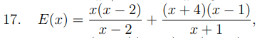
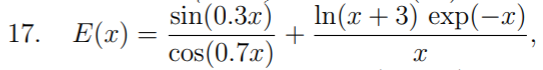
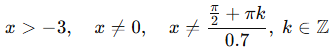

# Report lab03

## lab03_01
Variant number: 17

### Formula:

### Sourse code:
#include <stdio.h>
#include <math.h>

int main(void) {
    double x = 0.0;
    double a, b, c, d, e, E;
    printf("x = ");
    scanf("%lf", &x); 
    a = x*x - 9;
    b = x - 3;
    c = 2*x + 1;
    d = x + 4;
    e = 5 - x;
    E = a/b + (c*e)/d;
    printf("E(%.3f) = %.8f\n", x, E);
    return 0;
}

### Values of x and results:

x = 3.5
E(3.500) = 8.10000000

x = 4
E(4.000) = 8.12500000

x = -3.5
E(-3.500) = -102.50000000

### Debug session:

root@LAPTOP-R1MQP4P8:~/programming-part1/lab03# gcc -g -O0 -Wall -lm lab03_01.c -o lab03
root@LAPTOP-R1MQP4P8:~/programming-part1/lab03# gdb ./lab03
GNU gdb (Ubuntu 15.0.50.20240403-0ubuntu1) 15.0.50.20240403-git
Copyright (C) 2024 Free Software Foundation, Inc.
License GPLv3+: GNU GPL version 3 or later <http://gnu.org/licenses/gpl.html>
This is free software: you are free to change and redistribute it.
There is NO WARRANTY, to the extent permitted by law.
Type "show copying" and "show warranty" for details.
This GDB was configured as "x86_64-linux-gnu".
Type "show configuration" for configuration details.
For bug reporting instructions, please see:
<https://www.gnu.org/software/gdb/bugs/>.
Find the GDB manual and other documentation resources online at:
    <http://www.gnu.org/software/gdb/documentation/>.

For help, type "help".
Type "apropos word" to search for commands related to "word"...
Reading symbols from ./lab03...
(gdb) run
Starting program: /root/programming-part1/lab03/lab03 

This GDB supports auto-downloading debuginfo from the following URLs:
  <https://debuginfod.ubuntu.com>
Enable debuginfod for this session? (y or [n]) y
Debuginfod has been enabled.
To make this setting permanent, add 'set debuginfod enabled on' to .gdbinit.
Downloading separate debug info for system-supplied DSO at 0x7ffff7fc3000
[Thread debugging using libthread_db enabled]                                                                                                                                                                                                                                         
Using host libthread_db library "/lib/x86_64-linux-gnu/libthread_db.so.1".
x = 3.5
E(3.500) = 8.10000000
[Inferior 1 (process 9727) exited normally]
(gdb) next; print a; next; print b; next; print c; next; print e;
The program is not being run.
(gdb) run
Starting program: /root/programming-part1/lab03/lab03 
[Thread debugging using libthread_db enabled]
Using host libthread_db library "/lib/x86_64-linux-gnu/libthread_db.so.1".
x = 4
E(4.000) = 8.12500000
[Inferior 1 (process 10084) exited normally]
(gdb) run
Starting program: /root/programming-part1/lab03/lab03 
[Thread debugging using libthread_db enabled]
Using host libthread_db library "/lib/x86_64-linux-gnu/libthread_db.so.1".
x = -3.5
E(-3.500) = -102.50000000

## lab03_02
Variant number: 17

### Formula:

### Sourse code:

#include <stdio.h>
#include <math.h>

int main(void) {
    double x, E;

    printf("Enter x: ");
    scanf("%lf", &x);

    double a = sin(0.3*x);
    double b = cos(0.7*x);
    double c = log(x + 3);
    double d = exp(-x);
    double e = x;

    E = a/b + (c * d) / e;
    printf("E(%.3f) = %.8f\n", x, E);
    return 0;
}

### DOD

### Results: 

(gdb) print a
$1 = 0.99404320219807596
(gdb) print b
$2 = -0.71203271639831045
(gdb) print c
$3 = 2.1517622032594619
(gdb) print d
$4 = 0.003697863716482932
(gdb) print e
$5 = 5.5999999999999996
(gdb) print E
$6 = -1.3946430646652883

### Debug session:

root@LAPTOP-R1MQP4P8:~/programming-part1/lab03# gcc -g -O0 lab03_02.c -o lab03 -lm
root@LAPTOP-R1MQP4P8:~/programming-part1/lab03# gdb ./lab03
GNU gdb (Ubuntu 15.0.50.20240403-0ubuntu1) 15.0.50.20240403-git
Copyright (C) 2024 Free Software Foundation, Inc.
License GPLv3+: GNU GPL version 3 or later <http://gnu.org/licenses/gpl.html>
This is free software: you are free to change and redistribute it.
There is NO WARRANTY, to the extent permitted by law.
Type "show copying" and "show warranty" for details.
This GDB was configured as "x86_64-linux-gnu".
Type "show configuration" for configuration details.
For bug reporting instructions, please see:
<https://www.gnu.org/software/gdb/bugs/>.
Find the GDB manual and other documentation resources online at:
    <http://www.gnu.org/software/gdb/documentation/>.

For help, type "help".
Type "apropos word" to search for commands related to "word"...
Reading symbols from ./lab03...
(gdb) break main
Breakpoint 1 at 0x1215: file lab03_02.c, line 5.
(gdb) run
Starting program: /root/programming-part1/lab03/lab03 

This GDB supports auto-downloading debuginfo from the following URLs:
  <https://debuginfod.ubuntu.com>
Enable debuginfod for this session? (y or [n]) y
Debuginfod has been enabled.
To make this setting permanent, add 'set debuginfod enabled on' to .gdbinit.
Downloading separate debug info for system-supplied DSO at 0x7ffff7fc3000
[Thread debugging using libthread_db enabled]                                                                                                                                    
Using host libthread_db library "/lib/x86_64-linux-gnu/libthread_db.so.1".

Breakpoint 1, main () at lab03_02.c:5
5       int main(void) {
(gdb) n
8       printf("Enter x: ");
(gdb) n
9       scanf("%lf", &x);
(gdb) n
Enter x: 5.6
11      double a = sin(0.3*x);
(gdb) n
12      double b = cos(0.7*x);
(gdb) n
13      double c = log(x + 3);
(gdb) n
14      double d = exp(-x);
(gdb) n
15      double e = x;
(gdb) n
17      E = a/b + (c * d) / e;
(gdb) n
18      printf("E(%.3f) = %.8f\n", x, E);
(gdb) n
E(5.600) = -1.39464306
19      return 0;
(gdb) print a
$1 = 0.99404320219807596
(gdb) print b
$2 = -0.71203271639831045
(gdb) print c
$3 = 2.1517622032594619
(gdb) print d
$4 = 0.003697863716482932
(gdb) print e
$5 = 5.5999999999999996
(gdb) print E
$6 = -1.3946430646652883
(gdb) run
The program being debugged has been started already.
Start it from the beginning? (y or n) y
Starting program: /root/programming-part1/lab03/lab03 
[Thread debugging using libthread_db enabled]
Using host libthread_db library "/lib/x86_64-linux-gnu/libthread_db.so.1".