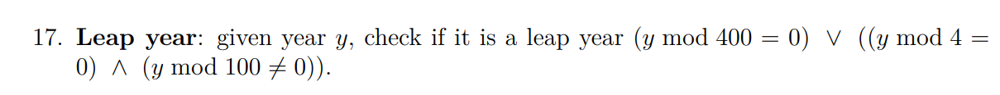
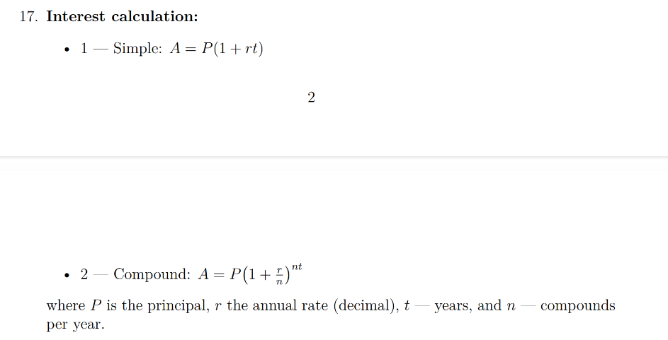

# Report04

## Report04_01
Variant number: 17

### Task:

### Sourse code:
#include <stdio.h>

int main(void) {
    int y;
    printf("Enter a year: ");
    scanf("%d" , &y);
    /*
    if(y % 400 == 0 || y % 4 == 0 && y % 100 != 0) {
        puts("leap");
     }
     else{
        puts("not leap");
     }
   */
   printf((y % 400 == 0 || (y % 4 == 0 && y % 100 != 0)) 
      ? " %d is leap\n" 
      : " %d is not leap\n",
      y); 

      return 0;
}

### Result:
2025 is not leap

### Debug session:
root@LAPTOP-R1MQP4P8:~/programming-part1/lab04# gcc -g -O0 -Wall -lm lab04_01.c -o lab04
root@LAPTOP-R1MQP4P8:~/programming-part1/lab04# gdb ./lab04
GNU gdb (Ubuntu 15.0.50.20240403-0ubuntu1) 15.0.50.20240403-git
Copyright (C) 2024 Free Software Foundation, Inc.
License GPLv3+: GNU GPL version 3 or later <http://gnu.org/licenses/gpl.html>
This is free software: you are free to change and redistribute it.
There is NO WARRANTY, to the extent permitted by law.
Type "show copying" and "show warranty" for details.
This GDB was configured as "x86_64-linux-gnu".
Type "show configuration" for configuration details.
For bug reporting instructions, please see:
<https://www.gnu.org/software/gdb/bugs/>.
Find the GDB manual and other documentation resources online at:
    <http://www.gnu.org/software/gdb/documentation/>.

For help, type "help".
Type "apropos word" to search for commands related to "word"...
Reading symbols from ./lab04...
(gdb) break main
Breakpoint 1 at 0x1195: file lab04_01.c, line 3.
(gdb) run
Starting program: /root/programming-part1/lab04/lab04 

This GDB supports auto-downloading debuginfo from the following URLs:
  <https://debuginfod.ubuntu.com>
Enable debuginfod for this session? (y or [n]) y
Debuginfod has been enabled.
To make this setting permanent, add 'set debuginfod enabled on' to .gdbinit.
[Thread debugging using libthread_db enabled]
Using host libthread_db library "/lib/x86_64-linux-gnu/libthread_db.so.1".

Breakpoint 1, main () at lab04_01.c:3
3       int main(void) {
(gdb) n
5           printf("Enter a year: ");
(gdb) n
6           scanf("%d" , &y);
(gdb) n
Enter a year: 2025
15         printf((y % 400 == 0 || (y % 4 == 0 && y % 100 != 0)) 
(gdb) n
 2025 is not leap
19      }

## Report04_02
Variant number: 17

### Task:

### Sourse code:
#include <stdio.h>
#include <math.h>

int main(void){
    int mode;
double A, P, r, t, n;

printf("choose the option:\n Simple - press: 1; Compound - press: 2\n ");
if (scanf("%d", &mode) != 1) {
    puts("Error: invalid input");
    return 1;
}
switch(mode){
    case 1:
        printf("enter principal: ");
        scanf("%lf", &P);

        printf("enter annual rate: ");
        scanf("%lf", &r);
        
        printf("enter years: ");
        scanf("%lf", &t);

        A = P * (1 + r * t);
        printf("result: %lf ", A);
        break;

    case 2:
        printf("enter principal: ");
        scanf("%lf", &P);

        printf("enter annual rate: ");
        scanf("%lf", &r);
        
        printf("enter years: ");
        scanf("%lf", &t);

        printf("enter compounds per year: ");
        scanf("%lf", &n);

        A = P * pow(1 + r / t, n * t);
        printf("result: %lf ", A);
        break;

    default:
        puts("Error: enter 1 or 2");
        return 2;
}
return 0;
}

### Result:
Simple result: 4400.000000
Compound result: 22509.375000

### Debug session:
root@LAPTOP-R1MQP4P8:~/programming-part1/lab04# gcc -g -O0 -Wall lab04_02.c -lm -o lab04
root@LAPTOP-R1MQP4P8:~/programming-part1/lab04# gdb ./lab04
GNU gdb (Ubuntu 15.0.50.20240403-0ubuntu1) 15.0.50.20240403-git
Copyright (C) 2024 Free Software Foundation, Inc.
License GPLv3+: GNU GPL version 3 or later <http://gnu.org/licenses/gpl.html>
This is free software: you are free to change and redistribute it.
There is NO WARRANTY, to the extent permitted by law.
Type "show copying" and "show warranty" for details.
This GDB was configured as "x86_64-linux-gnu".
Type "show configuration" for configuration details.
For bug reporting instructions, please see:
<https://www.gnu.org/software/gdb/bugs/>.
Find the GDB manual and other documentation resources online at:
    <http://www.gnu.org/software/gdb/documentation/>.

For help, type "help".
Type "apropos word" to search for commands related to "word"...
Reading symbols from ./lab04...
(gdb) break main
Breakpoint 1 at 0x11d5: file lab04_02.c, line 4.
(gdb) run
Starting program: /root/programming-part1/lab04/lab04 

This GDB supports auto-downloading debuginfo from the following URLs:
  <https://debuginfod.ubuntu.com>
Enable debuginfod for this session? (y or [n]) y
Debuginfod has been enabled.
To make this setting permanent, add 'set debuginfod enabled on' to .gdbinit.
[Thread debugging using libthread_db enabled]
Using host libthread_db library "/lib/x86_64-linux-gnu/libthread_db.so.1".

Breakpoint 1, main () at lab04_02.c:4
4       int main(void){
(gdb) n
9       printf("choose the option:\n Simple - press: 1; Compound - press: 2\n ");
(gdb) n
choose the option:
 Simple - press: 1; Compound - press: 2
10      if (scanf("%d", &mode) != 1) {
(gdb) n
 1
14      switch(mode){
(gdb) n
16              printf("enter principal: ");
(gdb) n
17              scanf("%lf", &P);
(gdb) n
enter principal: 400
19              printf("enter annual rate: ");
(gdb) n
20              scanf("%lf", &r);
(gdb) n
enter annual rate: 10
22              printf("enter years: ");
(gdb) n
23              scanf("%lf", &t);
(gdb) n
enter years: 1
25              A = P * (1 + r * t);
(gdb) n
26              printf("result: %lf ", A);
(gdb) n
27              break;
(gdb) n
50      return 0;
(gdb) n
51      }
(gdb) n
Download failed: Invalid argument.  Continuing without source file ./csu/../sysdeps/nptl/libc_start_call_main.h.
__libc_start_call_main (main=main@entry=0x5555555551c9 <main>, argc=argc@entry=1, argv=argv@entry=0x7fffffffde88) at ../sysdeps/nptl/libc_start_call_main.h:74
warning: 74     ../sysdeps/nptl/libc_start_call_main.h: No such file or directory
(gdb) n
result: 4400.000000 [Inferior 1 (process 64350) exited normally]
(gdb) n
The program is not being run.
(gdb) run
Starting program: /root/programming-part1/lab04/lab04 
[Thread debugging using libthread_db enabled]
Using host libthread_db library "/lib/x86_64-linux-gnu/libthread_db.so.1".

Breakpoint 1, main () at lab04_02.c:4
4       int main(void){
(gdb) n
9       printf("choose the option:\n Simple - press: 1; Compound - press: 2\n ");
(gdb) n
choose the option:
 Simple - press: 1; Compound - press: 2
10      if (scanf("%d", &mode) != 1) {
(gdb) n
 2
14      switch(mode){
(gdb) n
30              printf("enter principal: ");
(gdb) n
31              scanf("%lf", &P);
(gdb) n
enter principal: 150
33              printf("enter annual rate: ");
(gdb) n
34              scanf("%lf", &r);
(gdb) n
enter annual rate: 5
36              printf("enter years: ");
(gdb) n
37              scanf("%lf", &t);
(gdb) n
enter years: 2
39              printf("enter compounds per year: ");
(gdb) n
40              scanf("%lf", &n);
(gdb) n
enter compounds per year: 2
42              A = P * pow(1 + r / t, n * t);
(gdb) n
43              printf("result: %lf ", A);
(gdb) n
44              break;
(gdb) n
50      return 0;
(gdb) n
51      }
(gdb) n
Download failed: Invalid argument.  Continuing without source file ./csu/../sysdeps/nptl/libc_start_call_main.h.
__libc_start_call_main (main=main@entry=0x5555555551c9 <main>, argc=argc@entry=1, argv=argv@entry=0x7fffffffde88) at ../sysdeps/nptl/libc_start_call_main.h:74
warning: 74     ../sysdeps/nptl/libc_start_call_main.h: No such file or directory
(gdb) n
result: 22509.375000 [Inferior 1 (process 64998) exited normally]

## Report04_03

root@LAPTOP-R1MQP4P8:~/programming-part1/lab04# gdb ./lab04
GNU gdb (Ubuntu 15.0.50.20240403-0ubuntu1) 15.0.50.20240403-git
Copyright (C) 2024 Free Software Foundation, Inc.
License GPLv3+: GNU GPL version 3 or later <http://gnu.org/licenses/gpl.html>
This is free software: you are free to change and redistribute it.
There is NO WARRANTY, to the extent permitted by law.
Type "show copying" and "show warranty" for details.
This GDB was configured as "x86_64-linux-gnu".
Type "show configuration" for configuration details.
For bug reporting instructions, please see:
<https://www.gnu.org/software/gdb/bugs/>.
Find the GDB manual and other documentation resources online at:
    <http://www.gnu.org/software/gdb/documentation/>.

For help, type "help".
Type "apropos word" to search for commands related to "word"...
Reading symbols from ./lab04...
(gdb) break main
Breakpoint 1 at 0x11b5: file lab04_03.c, line 5.
(gdb) run
Starting program: /root/programming-part1/lab04/lab04 

This GDB supports auto-downloading debuginfo from the following URLs:
  <https://debuginfod.ubuntu.com>
Enable debuginfod for this session? (y or [n]) y
Debuginfod has been enabled.
To make this setting permanent, add 'set debuginfod enabled on' to .gdbinit.
Downloading separate debug info for system-supplied DSO at 0x7ffff7fc3000
[Thread debugging using libthread_db enabled]                                                                                                                                    
Using host libthread_db library "/lib/x86_64-linux-gnu/libthread_db.so.1".

Breakpoint 1, main () at lab04_03.c:5
5       int main(void) {
(gdb) n
8           const double x0_big = 0;
(gdb) n
9           const double y0_big = 0;
(gdb) n
10          const double x0_small = 1;
(gdb) n
11          const double y0_small = 0;
(gdb) n
13          const double EPS = 1e-9;
(gdb) n
14          const double R_big = 1.5;
(gdb) n
15          const double R_small = 1;
(gdb) n
20          printf("Enter x and y: ");
(gdb) n
21          if (scanf("%lf%lf", &x, &y) != 2 ){
(gdb) n
Enter x and y: 1 0
26          const double distance_big = pow(x - x0_big, 2) + pow(y - y0_big, 2);
(gdb) n
27          const double distance_small = pow(x - x0_small, 2) + pow(y - y0_small, 2);
(gdb) n
29          bool inside_big = distance_big <= R_big * R_big + EPS;
(gdb) n
30          bool inside_small = distance_small <= R_small * R_small + EPS;
(gdb) n
32          if(inside_big && inside_small){
(gdb) n
33              printf("YES");
(gdb) n
39       return 0;
