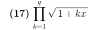
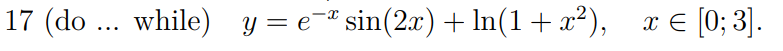

# Report05

## Report05_01
Variant number: 17

### Task:

### Sourse code:
#include <stdio.h>
#include <math.h>
#include <stdint.h>
#include <inttypes.h>   

int main() {

    int v;
    printf("To check Integer program press: 1\nTo check Floating-point program press: 2\n");
    if (scanf("%d", &v) != 1) {
        printf("invalid input!\n");
        return 1;
    }

    if (v == 1) {

        int q;
        int64_t x;
        int64_t result = 1;

        printf("Enter q and x: ");

        if (scanf("%d%" SCNd64, &q, &x) != 2 || q <= 0) {
            printf("invalid input!\n");
            return 1;
        }

        for (int k = 1; k <= q; k++) {

            int64_t inside_result = 1 + k * x;

            if (inside_result < 0) {
                printf("NaN\n");
                return 2;
            }

            double root_result = sqrt((double) inside_result);
            int64_t root_int = (int64_t) root_result;

            if (root_int == 0) {     
                printf("NaN\n");
                return 3;
            }

            if (result > INT64_MAX / root_int) {  
                printf("NaN\n");
                return 3;
            }

            result *= root_int;
        }

        printf("the result is: %" PRId64 "\n", result);
        return 0;
    }

    int q;
    int k = 1;
    long double x;
    long double result2 = 1;

    printf("Enter q and x: ");
        
        if(scanf("%d%Lf", &q, &x) !=2 || q <= 0) {
            printf("invalid input!");
            return 1;
        }

        while (k <= q) {
        long double inside_result = 1 + k * x;
            
            if(inside_result < 0) {
                printf("NaN\n");
                return 2;
        }

        long double root_result = sqrtl(inside_result);

        result2 *= root_result;
        k++;
    }
    printf("the result is: %Lf\n", result2);
    return 0;
}
### Result:
Enter q and x: 10 3
the result is: 288000

Enter q and x: 10 3.2
the result is: 977567.996625

### Debug session:
root@LAPTOP-R1MQP4P8:~/programming-part1/lab05# gcc -g -O0 -Wall lab05_01.c -lm -o lab05
root@LAPTOP-R1MQP4P8:~/programming-part1/lab05# gdb ./lab05
GNU gdb (Ubuntu 15.0.50.20240403-0ubuntu1) 15.0.50.20240403-git
Copyright (C) 2024 Free Software Foundation, Inc.
License GPLv3+: GNU GPL version 3 or later <http://gnu.org/licenses/gpl.html>
This is free software: you are free to change and redistribute it.
There is NO WARRANTY, to the extent permitted by law.
Type "show copying" and "show warranty" for details.
This GDB was configured as "x86_64-linux-gnu".
Type "show configuration" for configuration details.
For bug reporting instructions, please see:
<https://www.gnu.org/software/gdb/bugs/>.
Find the GDB manual and other documentation resources online at:
    <http://www.gnu.org/software/gdb/documentation/>.

For help, type "help".
--Type <RET> for more, q to quit, c to continue without paging--
Type "apropos word" to search for commands related to "word"...
Reading symbols from ./lab05...
(gdb) run
Starting program: /root/programming-part1/lab05/lab05 

This GDB supports auto-downloading debuginfo from the following URLs:
  <https://debuginfod.ubuntu.com>
Enable debuginfod for this session? (y or [n]) y
Debuginfod has been enabled.
To make this setting permanent, add 'set debuginfod enabled on' to .gdbinit.
Downloading separate debug info for system-supplied DSO at 0x7ffff7fc3000
[Thread debugging using libthread_db enabled]                                                                                                                     
Using host libthread_db library "/lib/x86_64-linux-gnu/libthread_db.so.1".
To check Integer program press: 1
To check Floating-point program press: 2
1
Enter q and x: 10 3
the result is: 288000
[Inferior 1 (process 361025) exited normally]
(gdb) run
Starting program: /root/programming-part1/lab05/lab05 
[Thread debugging using libthread_db enabled]
Using host libthread_db library "/lib/x86_64-linux-gnu/libthread_db.so.1".
To check Integer program press: 1
To check Floating-point program press: 2
2
Enter q and x: 10 3.2
the result is: 977567.996625
[Inferior 1 (process 361224) exited normally]

## Report05_02
Variant number: 17

### Task:

### Sourse code:
#include <stdio.h>
#include <math.h>

int main(void) {
    double a = 0;
    double b = 3;
    int n;
    printf("enter n: ");
    if(scanf("%d", &n) != 1 || n <= 2){
        printf("invalid input");
        return 1;
    }
    double h = (b - a) / (n - 1);
    int i = 0;
    double x = a;

    do{
        double y = exp(-x) * sin(2 * x) + log(1 + x * x);
        printf("%10.5f %12.5f\n", x, y);

        i++;
        x = a + i * h;

    } while(i < n);

    return 0;
}

### Result:
enter n: 7
   0.00000      0.00000
   0.50000      0.73352
   1.00000      1.02766
   1.50000      1.21014
   2.00000      1.50702
   2.50000      1.90229
   3.00000      2.28867
enter n: 3
   0.00000      0.00000
   1.50000      1.21014
   3.00000      2.28867

### Debug session:
root@LAPTOP-R1MQP4P8:~/programming-part1/lab05# gcc -g -O0 -Wall lab05_02.c -lm -o lab05
root@LAPTOP-R1MQP4P8:~/programming-part1/lab05# gdb ./lab05
GNU gdb (Ubuntu 15.0.50.20240403-0ubuntu1) 15.0.50.20240403-git
Copyright (C) 2024 Free Software Foundation, Inc.
License GPLv3+: GNU GPL version 3 or later <http://gnu.org/licenses/gpl.html>
This is free software: you are free to change and redistribute it.
There is NO WARRANTY, to the extent permitted by law.
Type "show copying" and "show warranty" for details.
--Type <RET> for more, q to quit, c to continue without paging--
This GDB was configured as "x86_64-linux-gnu".
Type "show configuration" for configuration details.
For bug reporting instructions, please see:
<https://www.gnu.org/software/gdb/bugs/>.
Find the GDB manual and other documentation resources online at:
    <http://www.gnu.org/software/gdb/documentation/>.
--Type <RET> for more, q to quit, c to continue without paging--

For help, type "help".
Type "apropos word" to search for commands related to "word"...
Reading symbols from ./lab05...
(gdb) run
Starting program: /root/programming-part1/lab05/lab05 

This GDB supports auto-downloading debuginfo from the following URLs:
  <https://debuginfod.ubuntu.com>
Enable debuginfod for this session? (y or [n]) y
Debuginfod has been enabled.
To make this setting permanent, add 'set debuginfod enabled on' to .gdbinit.
[Thread debugging using libthread_db enabled]
Using host libthread_db library "/lib/x86_64-linux-gnu/libthread_db.so.1".
enter n: 7
   0.00000      0.00000
   0.50000      0.73352
   1.00000      1.02766
   1.50000      1.21014
   2.00000      1.50702
   2.50000      1.90229
   3.00000      2.28867
[Inferior 1 (process 273607) exited normally]
(gdb) run
Starting program: /root/programming-part1/lab05/lab05 
[Thread debugging using libthread_db enabled]
Using host libthread_db library "/lib/x86_64-linux-gnu/libthread_db.so.1".
enter n: 3
   0.00000      0.00000
   1.50000      1.21014
   3.00000      2.28867
[Inferior 1 (process 273747) exited normally]
(gdb) run
Starting program: /root/programming-part1/lab05/lab05 
[Thread debugging using libthread_db enabled]
Using host libthread_db library "/lib/x86_64-linux-gnu/libthread_db.so.1".
enter n: 4
   0.00000      0.00000
   1.00000      1.02766
   2.00000      1.50702
   3.00000      2.28867
[Inferior 1 (process 273818) exited normally]

## Report05_03
Variant number: 17

### Sourse code:
#include <stdio.h>
#include <ctype.h>

int main(void) {

    unsigned long long n = 0;
    unsigned long long v = 0;
    unsigned long long p = 1;
    int ch;

    printf("Enter a number in base 8: ");
    v = 0;

    while((ch = getchar()) != '\n' && ch != EOF)
    {
        if (ch >= '0' && ch <= '7')
        {
            v = v * 8 + (ch - '0');
        }
    }

    printf("Number in base 4: ");

    if (v == 0)
    {
        putchar('0');
    }
    else
    {
        p = 1;
        while (p <= v / 4)
        {
            p *= 4;
        }

        while (p > 0)
        {
            unsigned d = (unsigned)(v / p);
            putchar('0' + d);
            v %= p;
            p /= 4;
        }
    }
    putchar('\n');

    printf("Enter a number in base 4: ");
    v = 0;

    while ((ch = getchar()) != '\n' && ch != EOF)
    {
        if (ch >= '0' && ch <= '3')
        {
            v = v * 4 + (ch - '0');
        }
    }

    printf("Number in base 8: ");

    if (v == 0)
    {
        putchar('0');
    }
    else
    {
        p = 1;
        while (p <= v / 8)
        {
            p *= 8;
        }

        while (p > 0)
        {
            unsigned d = (unsigned)(v / p);
            putchar('0' + d);
            v %= p;
            p /= 8;
        }
    }
    putchar('\n');

    return 0;
}

### Result:
Enter a number in base 8: 534
Number in base 4: 11130

Enter a number in base 4: 11130
Number in base 8: 534

### Debug session:
root@LAPTOP-R1MQP4P8:~/programming-part1# cd ./lab05
root@LAPTOP-R1MQP4P8:~/programming-part1/lab05# gcc -g -O0 -Wall lab05_03.c -lm -o lab05
lab05_03.c: In function ‘main’:
lab05_03.c:6:24: warning: unused variable ‘n’ [-Wunused-variable]
    6 |     unsigned long long n = 0;
      |                        ^
root@LAPTOP-R1MQP4P8:~/programming-part1/lab05# gdb ./lab05
GNU gdb (Ubuntu 15.0.50.20240403-0ubuntu1) 15.0.50.20240403-git
Copyright (C) 2024 Free Software Foundation, Inc.
License GPLv3+: GNU GPL version 3 or later <http://gnu.org/licenses/gpl.html>
This is free software: you are free to change and redistribute it.
There is NO WARRANTY, to the extent permitted by law.
Type "show copying" and "show warranty" for details.
This GDB was configured as "x86_64-linux-gnu".
Type "show configuration" for configuration details.
For bug reporting instructions, please see:
<https://www.gnu.org/software/gdb/bugs/>.
Find the GDB manual and other documentation resources online at:
    <http://www.gnu.org/software/gdb/documentation/>.

For help, type "help".
--Type <RET> for more, q to quit, c to continue without paging--
Type "apropos word" to search for commands related to "word"...
Reading symbols from ./lab05...
(gdb) run
Starting program: /root/programming-part1/lab05/lab05 

This GDB supports auto-downloading debuginfo from the following URLs:
  <https://debuginfod.ubuntu.com>
Enable debuginfod for this session? (y or [n]) y
Debuginfod has been enabled.
To make this setting permanent, add 'set debuginfod enabled on' to .gdbinit.
Downloading separate debug info for system-supplied DSO at 0x7ffff7fc3000
[Thread debugging using libthread_db enabled]                                                                                                                     
Using host libthread_db library "/lib/x86_64-linux-gnu/libthread_db.so.1".
Enter a number in base 8: 534
Number in base 4: 11130
Number in base 4: 11130
Number in base 8: 534
[Inferior 1 (process 284088) exited normally]